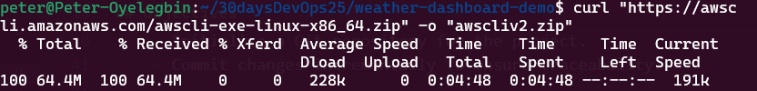
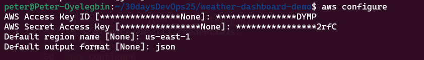
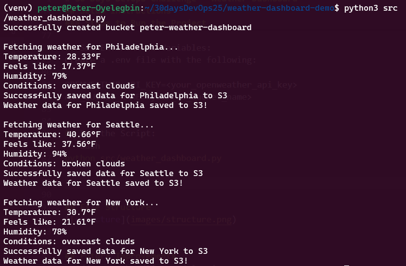
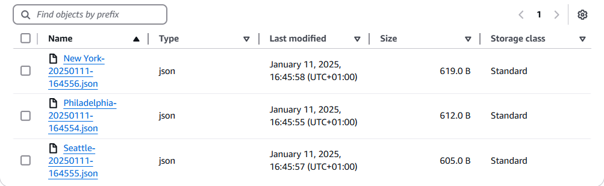
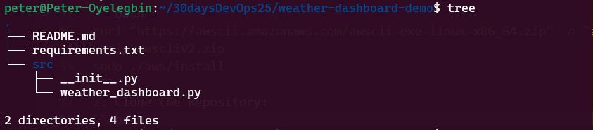

# 30 Days DevOps Challenge - Weather Dashboard
**Project Overview**
This project demonstrates core DevOps principles by building a Weather Dashboard. The system integrates external APIs, utilizes cloud storage, and showcases Python development and environment management skills.


## Key Features
- Real-time Weather Data Fetching: Integrates with the OpenWeather API to retrieve up-to-date weather information.

- Cloud Storage: Stores the fetched weather data in AWS S3 for scalability and reliability.

- Version Control: Utilizes Git for efficient version control and collaboration.

- Python Development: Implements the system using Python, highlighting scripting and automation skills.

- Environment Management: Manages dependencies and configurations effectively.


## Objectives
- Set Up OpenWeather API:
    - Obtain an API key by registering on the [OpenWeather website](https://openweathermap.org/).
    - Familiarize yourself with the OpenWeather API documentation to understand available endpoints and parameters.

- Configure AWS CLI for S3 Bucket:
    - Set up an S3 bucket for storing weather data.
    - Ensure proper IAM roles and permissions are in place for secure access.

- Environment Setup:
    - Install Python (recommended version: 3.9 or higher).
    - Create a virtual environment and install required dependencies using a requirements.txt file.

- Implement Weather Data Fetching:
    - Write a Python script to fetch weather data using the OpenWeather API.
    - Parse the JSON response to extract relevant weather information.

- Store Data in AWS S3:
    - Format the extracted data as JSON.
    - Upload the formatted data to the configured AWS S3 bucket.

- Version Control:
    - Initialize a Git repository for the project.
    - Commit changes incrementally to ensure traceability.


## Setup Instructions
### Prerequisites
- Python 3.9+
- AWS CLI configured with proper credentials
- OpenWeather API key

### Steps to Run the Project
1. Install the AWS CLI:
```bash
curl "https://awscli.amazonaws.com/awscli-exe-linux-x86_64.zip" -o "awscliv2.zip"
unzip awscliv2.zip
sudo ./aws/install
```


2. Configure AWS CLI credentials:
```bash
aws configure
```


3. Clone the Repository:
```bash
git clone [repository-url](https://github.com/PeterOyelegbin/weather-dashboard-demo.git)
cd weather-dashboard-demo
```

4. Install Dependencies:
```bash
python -m venv venv
source venv/bin/activate   # On Windows, use `venv\Scripts\activate`
pip install -r requirements.txt
```

5. Set Environment Variables:
Create a .env file with the following:
```
OPENWEATHER_API_KEY=<your_openweather_api_key>
AWS_BUCKET_NAME=<your_s3_bucket_name>
```

6. Run the Script:
```bash
python src/weather_dashboard.py
```


7. View data in the S3 Bucket



## File Structure



## Future Improvements
- Add error handling and logging.
- Schedule periodic data collection using AWS Lambda or a cron job.
- Visualize the weather data using a dashboard or graphs.
- Implement CI/CD pipelines for automated deployment.
